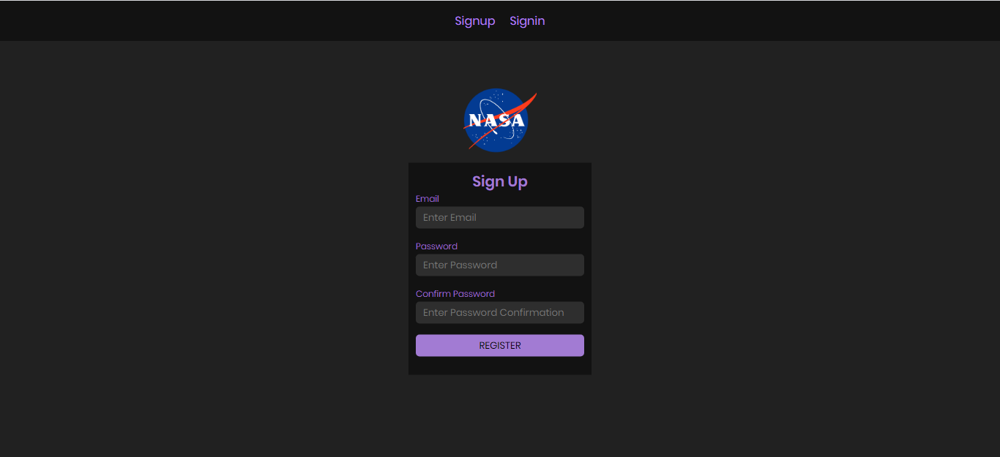
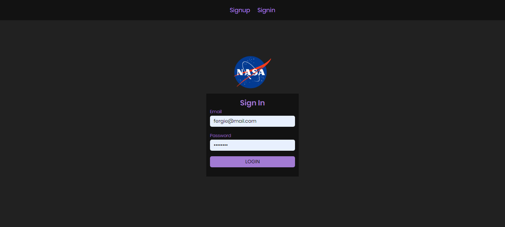
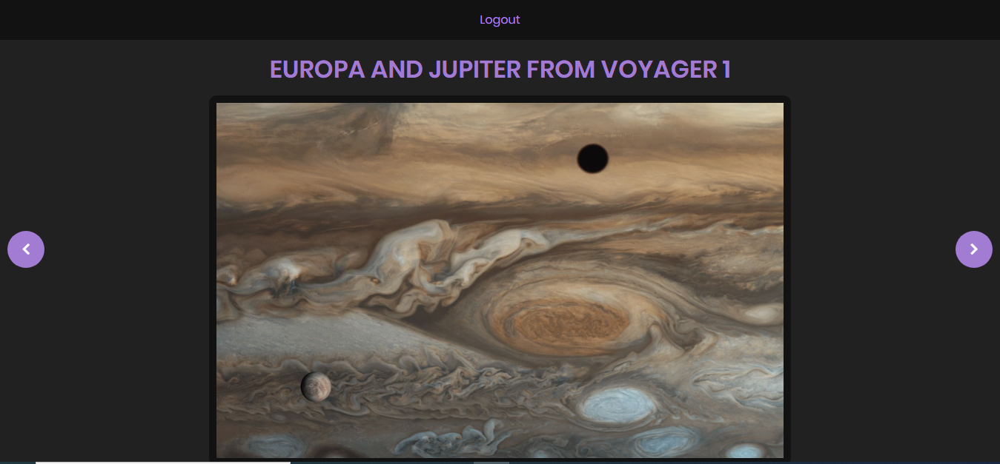
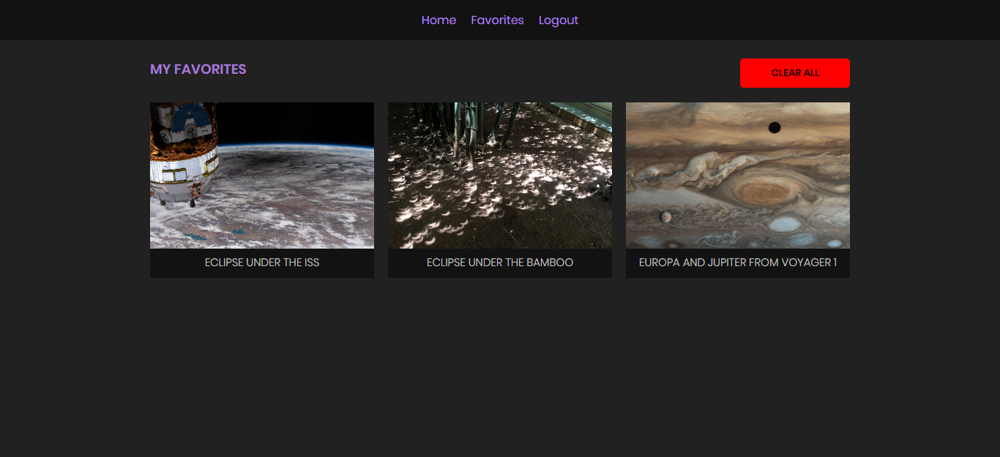

  PartnerHero Challenge

## Live Version

[Live Version](https://cryptic-ridge-38758.herokuapp.com/)

### Screenshots

#### Signup

#### Signin

#### Home

#### Favorites

## Project Specifications

- Display the picture of the day, its title and description based on the date selected from a
date picker.

- Save pictures of the day data into local storage.

- Ability to see and select any of the pictures of the day data saved as favourite.

- Ability to delete a single or all the favorited pictures of the day data from local storage.

- Ability to move the selected date for the picture of the day using previous and next day

buttons besides using the date picker.

- Display proper error messages when the HTTP request cannot be completed or there’s
no picture of the day available.

### Built With

- ReactJS
- Firebase

## Prerequisites
 - Git
 - Yarn
 - Node.js
 - NPM

## Getting Started

- git clone https://github.com/fegzycole/nasa-ph.git

- cd nasa-ph

- npm install

- npm start

## Testing

- npm test